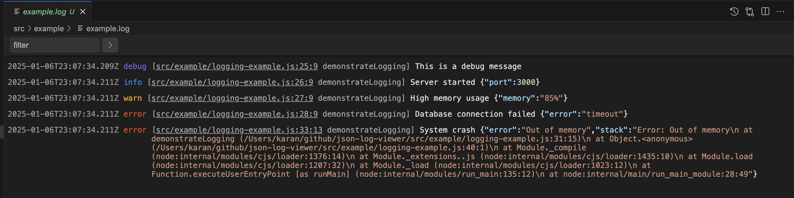

# JSON Log Viewer

A simple VS Code extension that displays JSON-formatted log files in a readable format. 

**Note:** This is a personal experimental project with hardcoded JSON log format support. Feel free to fork and adapt it to your needs. Contributions are welcome!



See [vsc-extension-quickstart.md](./vsc-extension-quickstart.md) for vscode extension quickstart.

## Setup and run:
```bash
# Install dependencies
npm install

# Compile
npm run compile

# Create the vsix file
npm run package
```
